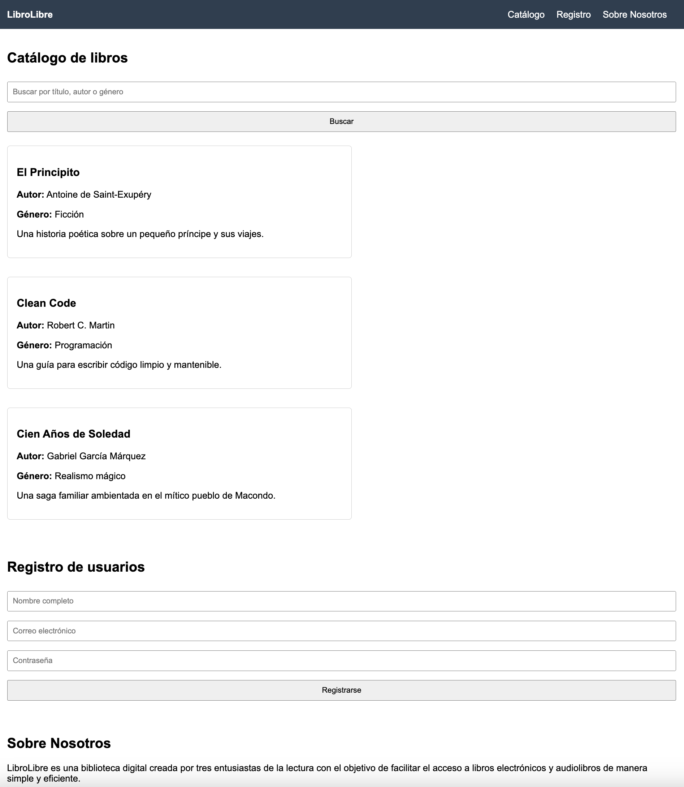

# 📚 LibroLibre

**Proyecto grupal - AE5_ABPRO**  
**Bootcamp Full Stack Python**  
Desarrollado por: Estefany Rodríguez P. y equipo

---

## 🌐 Descripción

**LibroLibre** es una biblioteca digital creada como ejercicio evaluado para el módulo AE5_ABPRO del Bootcamp Full Stack Python.  
El objetivo del proyecto es proporcionar a los usuarios una plataforma intuitiva y responsiva para buscar libros electrónicos o audiolibros, registrarse y consultar un catálogo de obras por título, autor o género.

---

## ✅ Funcionalidades

- 🔍 Búsqueda dinámica sin recarga de página por título, autor o género.
- 📚 Visualización del catálogo con información completa de cada libro (título, autor, sinopsis, género).
- 📝 Formulario de registro con validación de campos obligatorios.
- 📱 Diseño responsivo adaptado a dispositivos móviles y pantallas de escritorio.
- 📊 Contador de resultados dinámico (número de libros que coinciden con la búsqueda).
- ⚙️ Uso de eventos JS (`onclick`, `onchange`) y manipulación del DOM.
- 🧪 Mensajes de depuración mediante consola del navegador.

---

## 🧱 Tecnologías utilizadas

- **HTML5** – Estructura del sitio
- **CSS3** – Estilos personalizados
- **JavaScript (Vanilla JS)** – Lógica interactiva del sitio
- **Bootstrap 5** – Framework para diseño responsivo (CDN)

---

## 🗂️ Estructura del proyecto

```txt
LibroLibre/
├── index.html                   # Página principal del sitio
├── style.css                    # Estilos personalizados del sitio
├── script.js                    # Lógica JavaScript para búsqueda y validación
├── assets/
│   └── wireframe-librolibre.png # Imagen del wireframe (opcional)
└── README.md                    # Documentación del proyecto
```

---

## 💡 Cómo ejecutar el proyecto

1. Clona este repositorio o descarga el archivo `.zip`.
2. Abre `index.html` directamente en tu navegador preferido.
3. Usa la barra de búsqueda para buscar libros por título, autor o género.
4. Completa el formulario de registro para probar la validación.
5. Abre la consola del navegador (`F12`) para ver los mensajes de depuración.

---

## 📋 Requisitos cumplidos

### 📄 HTML

- Barra de navegación con enlaces internos.
- Formulario de búsqueda interactiva.
- Tarjetas de libros con datos clave.
- Formulario de registro con campos validados.
- Sección informativa "Sobre nosotros".

### ⚙️ JavaScript

- Manipulación del DOM para mostrar/ocultar libros.
- Validación del formulario de registro.
- Eventos: `onclick`, `onchange`.
- Expresiones aritméticas: contador de resultados.
- Búsqueda dinámica sin recargar la página.
- Consola del navegador usada para depuración.

### 🎨 Diseño responsivo

- Uso de Bootstrap 5 y media queries para adaptabilidad móvil y escritorio.

---

## 🧩 Wireframe del diseño

A continuación, se muestra el diseño base que sirvió como guía para construir la estructura del sitio web:



> _Este wireframe ayudó a organizar visualmente el contenido, secciones y navegación del sitio._

---

## 👩‍💻 Autora principal

- GitHub: [EstefanyRodriguezP](https://github.com/EstefanyRodriguezP)

---

## 📝 Observación

Este proyecto fue desarrollado como parte del aprendizaje en el Bootcamp Full Stack Python, aplicando los fundamentos del desarrollo web con HTML, CSS y JavaScript, como paso previo al desarrollo back-end con Python y frameworks modernos.
